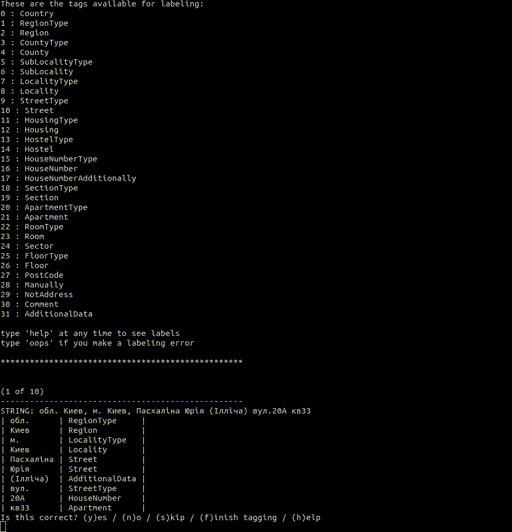
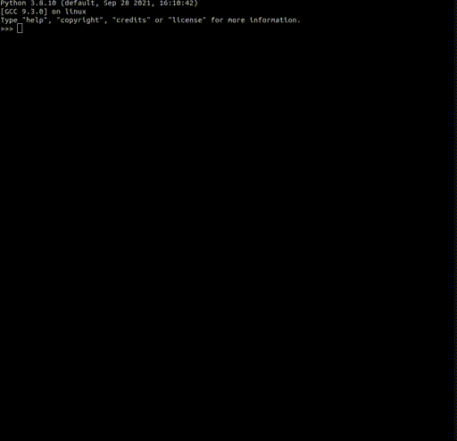

# Description
[](https://badge.fury.io/py/uaddress)

Parse the address into types. Library adaptation [usaddress](https://github.com/datamade/usaddress) under Ukrainian address

> Read this in other language: [English](README.en.md), [Русский](README.md), [Український](README.ua.md)

# Requirements
* python3
* [parserator](https://github.com/martinjack/parserator)

# Install
```sh
pip3 install uaddress
```
# Install local
```sh
python3 setup.py install --user
```

# Train model
```shell
parserator train training/data.xml uaddress
```
### When another path model
```shell
parserator train training/data.xml uaddress --modelfile anotherpath/uaddr.crfsuite
```

# Testing model
```shell
parserator label training/raw.csv training/data.xml uaddress
```
### When another path model
```shell
parserator label trainig/raw.csv training/data.xml uaddress --modelfile anotherpath/uaddr.crfsuite
```

# Structure
| File                      | Description                                   |
| :-------------            | :-------------                                |
| training/data.xml         | Model dataset                                 |
| training/raw.csv          | List addresses from training or testing       |
| uaddress/uaddr.crfsuite   | NLP model                                     |

# Examples


## Example script
```sh 
python3 example.py
```


# Types
| Name                      | Description                                   |
| :-------------            | :-------------                                |
| Country                   | Country                                       |
| RegionType                | Type region                                   |
| Region                    | Region                                        |
| CountyType                | Type county                                   |
| County                    | County                                        |
| SubLocalityType           | Type sublocality                              |
| SubLocality               | Sublocality                                   |
| LocalityType              | Type locality                                 |
| Locality                  | Locality                                      |
| StreetType                | Type street                                   |
| Street                    | Street                                        |
| HousingType               | Type housing                                  |
| Housing                   | Housing                                       |
| HostelType                | Type hostel                                   |
| Hostel                    | Hostel                                        |
| HouseNumberType           | Type house number                             |
| HouseNumber               | Number house                                  |
| HouseNumberAdditionally   | Additional house number                       |
| SectionType               | Type section                                  |
| Section                   | Section                                       |
| ApartmentType             | Type apartment                                |
| Apartment                 | Apartment                                     |
| RoomType                  | Type room                                     |
| Room                      | Room                                          |
| Sector                    | Sector                                        |
| FloorType                 | Type floor                                    |
| Floor                     | Floor                                         |
| PostCode                  | Index                                         |
| Manually                  | Kit types for further parsing address         |
| NotAddress                | Not address                                   |
| Comment                   | Comment                                       |
| AdditionalData            | Additional data                               |