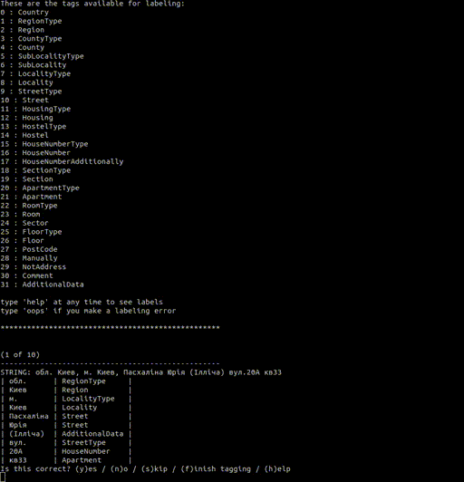
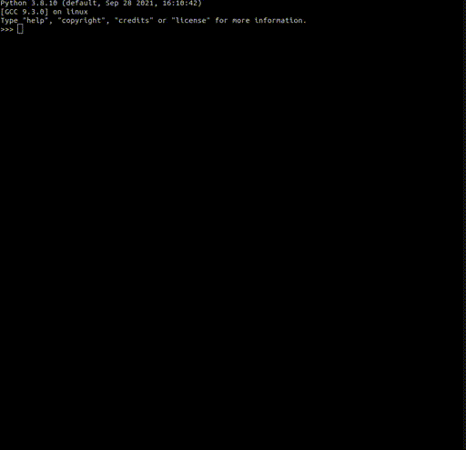

# UAddress - NLP Парсер украинских адресов

# Описание
Разборка адреса на типы. Адаптация библиотеки [usaddress](https://github.com/datamade/usaddress) под украинские адреса 

> Read this in other language: [English](README.en.md), [Русский](README.md), [Український](README.ua.md)

# Требования
* python3
* [parserator](https://github.com/martinjack/parserator)

# Установка
```sh
pip3 install uaddress
```
# Установка локально
```sh
python3 setup.py install --user
```

# Обучение модели
```shell
parserator train training/data.xml uaddress
```
### Когда другое расположение модели
```shell
parserator train training/data.xml uaddress --modelfile anotherpath/uaddr.crfsuite
```

# Тестирование модели
```shell
parserator label training/raw.csv training/data.xml uaddress
```
### Когда другое расположение модели
```shell
parserator label trainig/raw.csv training/data.xml uaddress --modelfile anotherpath/uaddr.crfsuite
```

# Структура
| Файл                      | Описание                                      |
| :-------------            | :-------------                                |
| training/data.xml         | Набор данных для модели                       |
| training/raw.csv          | Список адресов для обучения или проверки      |
| uaddress/uaddr.crfsuite   | NLP модель                                    |

# Примеры


## Пример скрипта
```sh 
python3 example.py
```


# Типы
| Название                  | Описание                                      |
| :-------------            | :-------------                                |
| Country                   | Страна                                        |
| RegionType                | Тип области                                   |
| Region                    | Область                                       |
| CountyType                | Тип района                                    |
| County                    | Район                                         |
| SubLocalityType           | Тип подрайона                                 |
| SubLocality               | Подрайон                                      |
| LocalityType              | Тип населённого пункта                        |
| Locality                  | Населённый пункт                              |
| StreetType                | Тип улицы                                     |
| Street                    | Улица                                         |
| HousingType               | Тип корпуса                                   |
| Housing                   | Корпус                                        |
| HostelType                | Тип общежития                                 |
| Hostel                    | Общежитие                                     |
| HouseNumberType           | Тип номера дома                               |
| HouseNumber               | Номер дома                                    |
| HouseNumberAdditionally   | Дополнительный номер дома                     |
| SectionType               | Тип секции                                    |
| Section                   | Секция                                        |
| ApartmentType             | Тип квартиры                                  |
| Apartment                 | Квартира                                      |
| RoomType                  | Тип комнаты                                   |
| Room                      | Комната                                       |
| Sector                    | Сектор                                        |
| FloorType                 | Тип этажа                                     |
| Floor                     | Этаж                                          |
| PostCode                  | Индекс                                        |
| Manually                  | Набор типов для дальнейшей разборки адреса    |
| NotAddress                | Не адрес                                      |
| Comment                   | Комментарий                                   |
| AdditionalData            | Дополнительные данные                         |